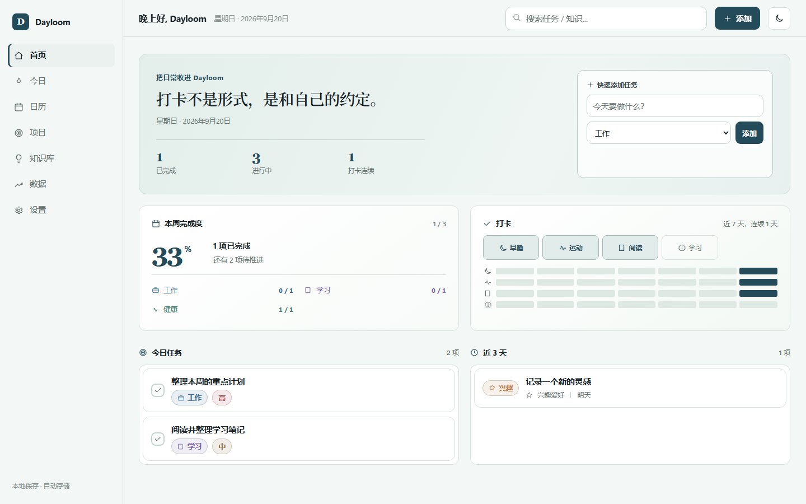

<div align="center">

# Dayloom

### 把计划、习惯和灵感，收进日常。

一个清爽、可定制的个人管理空间，把任务推进、习惯养成和知识积累放在同一处。

</div>



## 你可以用 Dayloom 做什么

- **安排任务**：按项目和状态管理工作、学习与生活，快速看清今天和未来三天。
- **坚持习惯**：记录早睡、运动、阅读与学习，也可以创建自己的打卡项目。
- **积累知识**：用分级标签整理卡片，在每日知识阅读中重新遇见过去的内容。
- **回顾状态**：把心情和打卡放进月度视图，看见自己的生活节奏。
- **自由定制**：项目、习惯和主题配色都能修改，初始内容保持空白。

## 在电脑上使用

安装 [Node.js 24+](https://nodejs.org/)，下载项目后在文件夹中运行：

```bash
node server.js
```

然后打开 [http://127.0.0.1:8787](http://127.0.0.1:8787)。项目不需要安装 npm 依赖。

也可以直接双击 `index.html` 体验离线功能。这个方式的数据只保存在当前浏览器中，不提供账号同步。

## 数据保存

- 任务、设置和打卡默认保存在浏览器 `localStorage`。
- 知识卡片默认保存在浏览器 `IndexedDB`。
- 登录同步后，完整数据按账号写入 SQLite。
- Windows 上的 SQLite 默认位于 `%LOCALAPPDATA%/EverydayWorktable`，不会进入代码仓库。
- 设置页支持导入和导出完整 JSON 备份。

## 跨设备同步

项目包含 Node 同源服务、账号登录和 SQLite 同步功能。同一个账号可以在多台设备读取数据；发生版本冲突时，Dayloom 会暂停同步并让用户选择保留的版本。

完整的服务器、HTTPS、迁移和备份步骤见 [同步部署指南](docs/sync-deployment.md)。GitHub Pages 只能托管静态前端，不能运行 Node 服务或 SQLite 数据库。

## 开发与检查

```bash
npm test
```

测试覆盖默认数据、旧版本迁移、账号隔离、SQLite 持久化和同步版本冲突。
