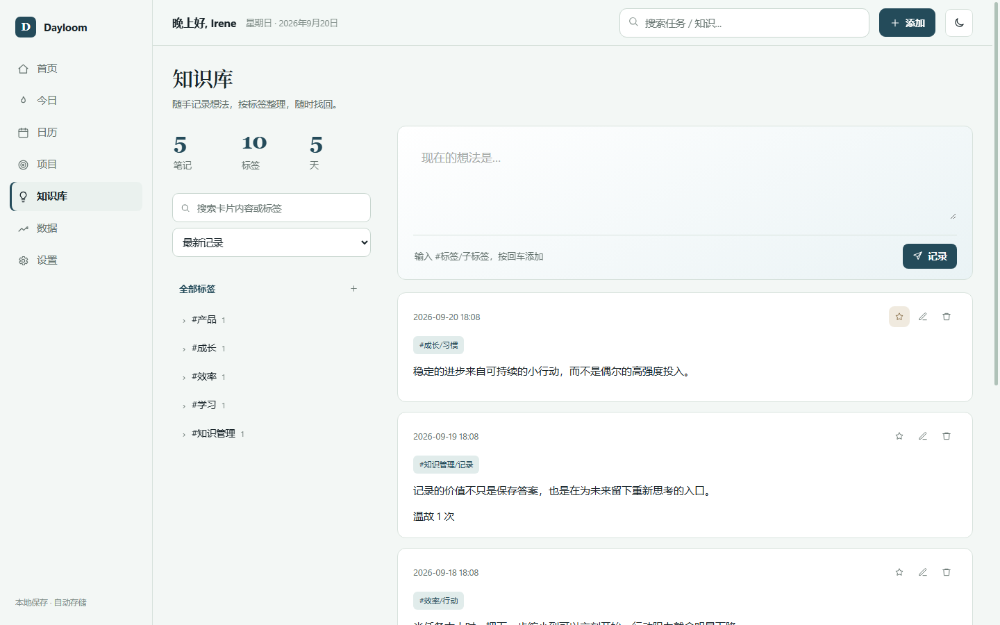
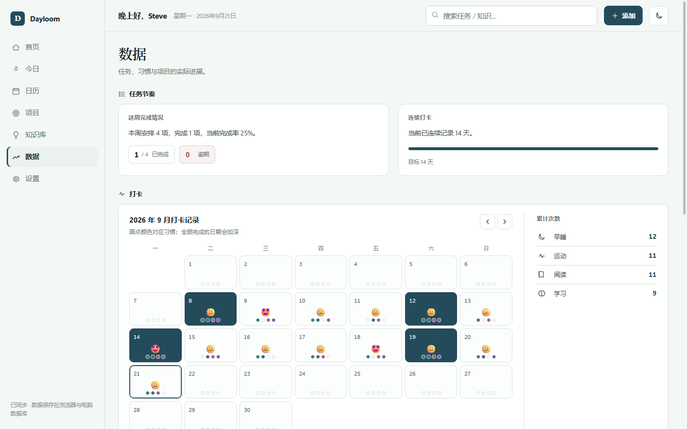
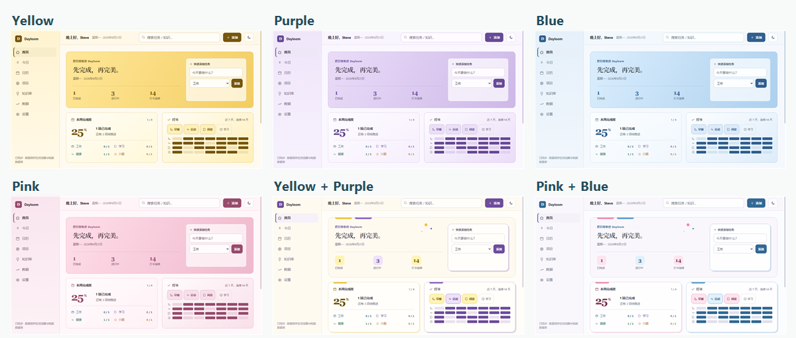

<div align="center">

# Dayloom

### 把计划、习惯和灵感，收进日常。

一个清爽、可定制的个人管理空间，把任务推进、习惯养成和知识积累放在同一处。

</div>

## 首页

首页把最常用的信息集中在一屏：本周任务完成度、最近七天的习惯打卡、今天需要处理的任务，以及未来三天的安排。顶部可以直接快速新增任务，不必先进入项目页面。


## 今日

今日页面用来记录和完成当天的事情：

- 写下今日随笔，保存后自动进入本地知识库。
- 完成当天的习惯打卡，并记录今天的心情。
- 在“今日聚焦”中查看最需要推进的任务。
- 查看系统从知识库中选出的每日候选卡片，并通过参考卡片回到原始记录；接入 AI 后可以进一步生成跨卡片洞察。

## 日历

日历提供月视图和周视图，可以前后切换日期。每天的任务会显示在对应日期下，也可以直接在某一天新增安排，用时间顺序查看过去和接下来的计划。

## 项目

项目页面用看板整理不同领域的任务。默认包含工作事业、长期学习、运动健康、兴趣爱好、日常生活和副业探索，也可以只查看其中一个项目。

任务按待办、进行中、待检查和已完成分栏展示，可以拖动改变状态，也可以点击标题继续编辑任务内容、优先级、日期和所属项目。

## 知识库

知识库适合随手记录想法、摘录和学习笔记：

- 使用 `#标签/子标签/子标签` 建立分级标签。
- 输入标签时自动推荐已有层级，也可以直接创建新标签。
- 搜索卡片正文或标签，支持中文内容查找。
- 在原卡片位置直接编辑，保留阅读上下文。
- 收藏重要卡片；系统也会选出每日候选卡片，帮助重新回顾过去的记录。



## 数据

数据页面把任务进展和生活记录放在一起。你可以查看本周任务完成情况、连续打卡天数，以及不同习惯的累计次数。月度打卡日历同时显示每天的心情和当前启用的习惯（默认四项）；当天全部完成时，日期格会以深色突出，并且可以切换查看不同月份。



## 设置

设置页可以把 Dayloom 调整成适合自己的样子：

- 修改称呼，并选择亮色或暗色界面。
- 修改默认项目的名称和颜色，也可以新增或删除具体项目。
- 修改打卡项目的名称、表情和颜色，也可以新增或删除具体打卡。
- 删除项目时保留原有任务；删除打卡时保留历史记录。
- 切换整套界面配色，不改变已有内容。
- 导出或导入完整 JSON 备份，并管理登录与跨设备同步。

## 配色展示

Dayloom 提供安静的默认色以及黄色、紫色、蓝色、粉色和拼色主题。不同配色会统一调整背景、卡片、按钮和强调色，项目类别仍保留各自的识别颜色。



## 在电脑上使用

安装 [Node.js 24+](https://nodejs.org/)，下载项目后在文件夹中运行：

```bash
node server.js
```

然后打开 [http://127.0.0.1:8787](http://127.0.0.1:8787)。项目不需要安装 npm 依赖。

也可以直接双击 `index.html` 体验离线功能。这个方式的数据只保存在当前浏览器中，不提供账号同步。`file://` 页面和 `http://127.0.0.1:8787` 属于两个独立地址，各自拥有不同的浏览器本地数据；切换使用方式前可以先导出 JSON，再到新地址导入。

## 数据保存

- 任务、设置和打卡默认保存在浏览器 `localStorage`。
- 知识卡片默认保存在浏览器 `IndexedDB`。
- 登录同步后，完整数据按账号写入运行 Node 服务的设备上的 SQLite。
- Windows 上的 SQLite 默认位于 `%LOCALAPPDATA%/EverydayWorktable`，不会进入代码仓库。
- 设置页支持导入和导出完整 JSON 备份。

## 跨设备同步

项目包含 Node 同源服务、账号登录和 SQLite 同步功能。同一个账号可以在多台设备读取数据；发生版本冲突时，Dayloom 会暂停同步并让用户选择保留的版本。

完整的服务器、HTTPS、迁移和备份步骤见 [同步部署指南](docs/sync-deployment.md)。GitHub Pages 只能托管静态前端，不能运行 Node 服务或 SQLite 数据库。

## 开发与检查

```bash
npm test
```

测试覆盖默认数据、旧版本迁移、账号隔离、SQLite 持久化和同步版本冲突。
