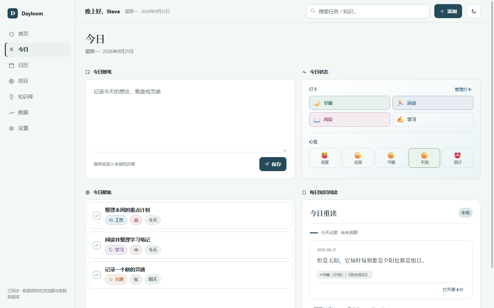
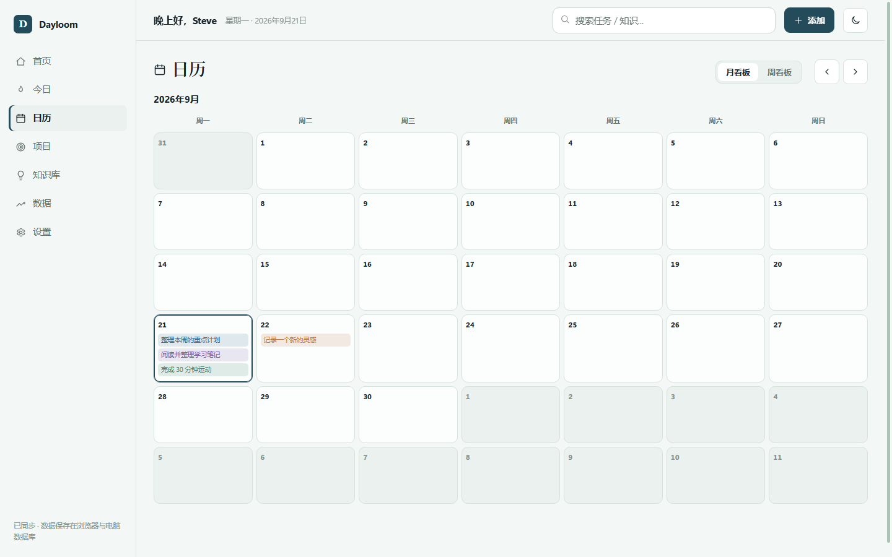
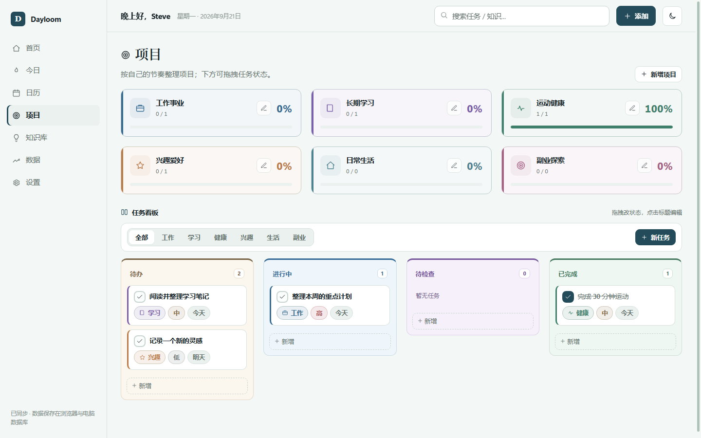
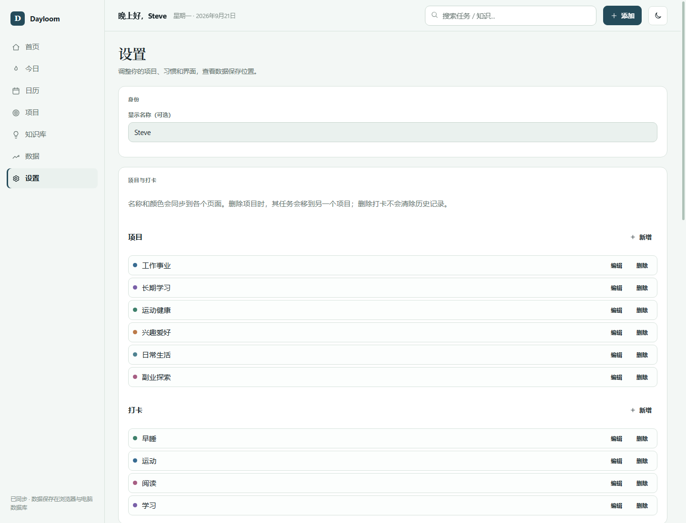

<div align="center">

# Dayloom

### 把计划、习惯和灵感，收进日常。

一个清爽、可定制的个人管理空间，把任务推进、习惯养成和知识积累放在同一处。

</div>

早上安排今天的重点，白天收下零散想法，晚上看看完成了什么。Dayloom 为独立管理工作、学习和生活的人，把这些日常动作放在一起。

- **内容留在自己的电脑**：本机版无需注册，自动保存到 SQLite；断网也能使用。
- **记录可以不断积累**：任务、习惯、心情和分级知识卡片集中管理；每日知识阅读会把旧卡片重新带回视野。
- **按自己的节奏调整**：项目和打卡可以增删，七套配色与亮暗模式可自由选择。

[开始使用](#在电脑上使用) · [每日知识阅读](#每日知识阅读) · [知识库](#知识库) · [配色展示](#配色展示) · [数据与隐私](docs/privacy.md)

当前为 **0.3.0-beta.1 电脑端测试版**，优先支持 Windows + Chrome / Edge。截图和首次启动内容均为通用示例，不包含开发者的个人数据。

## 首页

首页把最常用的信息集中在一屏：本周任务完成度、最近七天的习惯打卡、今天需要处理的任务，以及未来三天的安排。顶部可以直接快速新增任务，不必先进入项目页面。


## 今日

今日页面用来记录和完成当天的事情：

- 写下今日随笔，保存后自动进入本地知识库。
- 完成当天的习惯打卡，并记录今天的心情。
- 在“今日聚焦”中查看最需要推进的任务。
- 使用“每日知识阅读”重读旧卡片，或让 AI 从多张卡片中寻找联系。



## 每日知识阅读

知识不应只被记录一次。Dayloom 会在“今日”页面重新带回知识库中的内容，并提供两种使用方式：

| 模式 | 是否需要 API | 会做什么 |
| --- | --- | --- |
| **今日重读（本地）** | 不需要 | 每天从本地知识库选出一张较久未回顾的卡片，并列出同批候选中的相关卡片。内容始终留在电脑上。 |
| **知识碰撞（AI）** | 需要用户自行配置 | 将预览中的多张卡片交给所选 AI 服务，寻找共性、矛盾和可延伸的新问题，并标出参考卡片。 |

### 直接使用本地回顾

1. 在知识库记录卡片；只有一张卡片也可以开始使用。
2. 打开 **今日 → 每日知识阅读**，系统会自动显示当天的“今日重读”。
3. 可以展开长内容、打开原卡片、收藏、换一张，或点击“写下新想法”继续记录。
4. 卡片达到多张后，下方还会出现本地相关卡片，点击即可回到对应原文。

本地模式是默认模式，不需要联网、账号或 API。它负责重新发现已有内容，不会伪装成 AI 总结。

### 可选开启 AI 知识碰撞

1. 通过 `node server.js` 或 **Start-Dayloom.cmd** 打开本机版；直接双击 HTML 时不能配置 AI。
2. 进入 **设置 → AI 阅读**，填写兼容 OpenAI `/chat/completions` 格式的 API 地址、模型名称和 API Key，然后保存并测试连接。API 地址可以填写服务商提供的基础 `/v1` 地址，也可以填写完整的 `/chat/completions` 地址；本地兼容服务可能不需要 Key。
3. 至少准备两张知识卡片，再回到 **今日 → 每日知识阅读**，点击 **生成知识碰撞**。
4. Dayloom 会先列出即将发送的卡片。确认内容无误后，点击 **确认并生成**。
5. 生成结果会保留参考卡片入口，并随当天数据保存在本机、进入 JSON 备份；可以重新生成，也可以随时返回本地“今日重读”。

## 日历

日历提供月视图和周视图，可以前后切换日期。每天的任务会显示在对应日期下，也可以直接在某一天新增安排，用时间顺序查看过去和接下来的计划。



## 项目

项目页面用看板整理不同领域的任务。默认包含工作事业、长期学习、运动健康、兴趣爱好、日常生活和副业探索，也可以只查看其中一个项目。

任务按待办、进行中、待检查和已完成分栏展示，可以拖动改变状态，也可以点击标题继续编辑任务内容、优先级、日期和所属项目。



## 知识库

知识库适合随手记录想法、摘录和学习笔记：

- 使用 `#标签/子标签/子标签` 建立分级标签。
- 输入标签时自动推荐已有层级，也可以直接创建新标签。
- 搜索卡片正文或标签，支持中文内容查找。
- 在原卡片位置直接编辑，保留阅读上下文。
- 收藏重要卡片；系统也会选出每日候选卡片，帮助重新回顾过去的记录。


## 数据

数据页面把任务进展和生活记录放在一起。你可以查看本周任务完成情况、连续打卡天数，以及不同习惯的累计次数。月度打卡日历同时显示每天的心情和当前启用的习惯（默认四项）；当天全部完成时，日期格会以深色突出，并且可以切换查看不同月份。


## 设置

设置页可以把 Dayloom 调整成适合自己的样子：

- 修改称呼，并选择亮色或暗色界面。
- 修改默认项目的名称和颜色，也可以新增或删除具体项目。
- 修改打卡项目的名称、表情和颜色，也可以新增或删除具体打卡。
- 删除项目时保留原有任务；删除打卡时保留历史记录。
- 切换整套界面配色，不改变已有内容。
- 导出或导入完整 JSON 备份，查看保存状态和电脑数据库的位置；本机模式不需要账号。



## 配色展示

Dayloom 提供安静的默认色以及黄色、紫色、蓝色、粉色、黄紫拼色和粉蓝拼色主题。不同配色会统一调整背景、卡片、按钮和强调色，项目类别仍保留各自的识别颜色。


## 在电脑上使用

第一次使用只需要准备一次 Node.js，以后双击启动文件即可：

1. 在本项目 GitHub 页面点击 **Code → Download ZIP**，解压整个文件夹；也可以使用提供的本地预览压缩包。
2. 安装 [Node.js 24 或更高版本](https://nodejs.org/)，使用默认安装选项。数据库已包含在 Node 中，无需另装 SQLite，也无需 `npm install`。
3. 在解压后的文件夹中双击 **Start-Dayloom.cmd**，保留启动窗口。
4. 看到窗口显示地址后，用浏览器打开 [http://127.0.0.1:8787](http://127.0.0.1:8787)。
5. 添加第一条任务，在左下角看到 **“已保存到电脑数据库”** 即表示写入成功。

也可以在包含 `server.js` 的目录中打开终端运行：

```bash
node server.js
```

下次使用仍然双击启动文件，再打开浏览器。退出前等待保存完成，然后在启动窗口按 `Ctrl+C`。地址 `127.0.0.1` 指使用者自己的电脑，并不是公共网站。

想先看看界面，也可以双击 `index.html`。这种体验方式仅保存在浏览器，清除网站数据可能丢失内容。已有 HTML 版记录请先导出 JSON，再到本机服务地址导入，两种地址不会自动互相读取。

详细操作步骤、迁移、备份和故障处理见 [Windows 使用指南](docs/windows-guide.md)。

## 数据保存

本机版启动后，任务、知识库、习惯、心情和设置自动写入电脑数据库，浏览器保留缓存。同一个 Windows 用户、同一个服务的数据可从不同浏览器读取；发生版本冲突时会提示选择，不会自动合并。

新安装的默认数据库路径是 `%LOCALAPPDATA%\Dayloom\worktable.sqlite`。如果检测到旧版 `EverydayWorktable` 数据库，程序会沿用旧路径；**设置 → 电脑存储** 显示实际位置。数据库不放在项目代码文件夹里。

默认没有遥测、广告或后台 AI 上传。只有用户配置 AI 服务、主动确认卡片并点击生成时，选中的卡片才会发送到对应服务。数据库和 JSON 备份不加密。定期在设置中导出备份，升级或迁移前也请先备份。当前完整数据快照上限约 10 MB，适合文字卡片和个人任务记录。

详细说明见 [数据与隐私](docs/privacy.md)。

## 跨设备同步

本次发布面向电脑本地使用，暂不提供移动端安装包或托管云服务。默认本机模式只接受自己电脑的访问，无需登录。

仓库保留可选的账号服务实验功能，需要显式启用 `DAYLOOM_MODE=accounts`。跨设备使用还需要自行部署一个双方都能访问的服务，并在同一服务登录同一账号。仅下载代码或打开同名账号，不会自动获得云同步。

完整的服务器、HTTPS、迁移和备份步骤见 [同步部署指南](docs/sync-deployment.md)。GitHub Pages 只能托管静态前端，不能运行 Node 服务或 SQLite 数据库。

## 版本与许可

当前是桌面测试版，已在 Windows 环境验证；其他系统与浏览器尚未作为正式支持目标。原生安装包和手机离线同步尚未交付。AI 阅读使用用户自行配置的兼容接口，调用费用和数据处理规则由对应服务提供方决定。

许可由项目作者确认中，当前未授予 MIT 等开源许可。发布准备包仅供作者本地检查；确定许可后再正式公开发布。更多变化见 [版本说明](CHANGELOG.md)。

## 开发与检查

```bash
npm test
```

测试覆盖默认数据、旧版本迁移、本机数据库恢复、账号隔离、SQLite 持久化和版本冲突。
